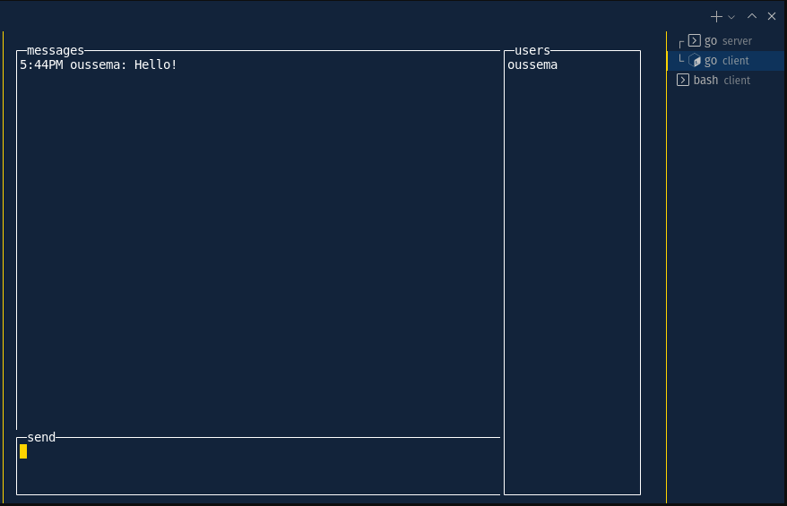

# Cli chat that supports Kerberos Authentification, Written in Golang

## Prerequisites
You need to have a KDC server configured and accessible by the client and server.

You need to obtain a keytab for your user, and the kd5.conf to load it to the client config.

## Debug Mode:
To enable Debug mode on the client side, for extra information,
set an environment Variables `CLI_CHAT_DEBUG=1` and run the client
Happy Chatting!